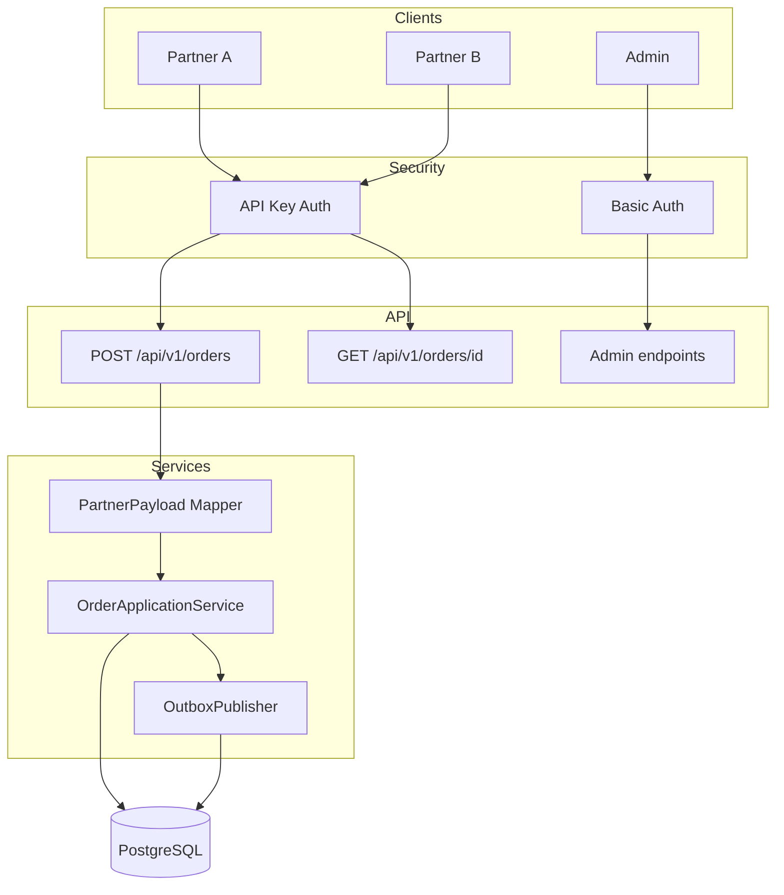

# Integration Hub API

B2B enterprise middleware that receives partner order payloads, normalizes them to a canonical order model, persists them reliably, and publishes events using the Outbox pattern with retries and dead-letter handling.

## Overview

- **Partners** send orders in different schemas (Partner A, Partner B, etc.)

## Architecture Overview


- The system validates, transforms, and persists raw + normalized payloads
- **Idempotency** ensures duplicates do not create new orders
- **Outbox pattern** guarantees reliable event publishing with retries and dead-letter handling
- **Dual security**: API key for partners, Basic auth for admin

## Prerequisites

- Java 21
- Maven 3.9+
- Docker & Docker Compose (for local Postgres)

## Run Locally

1. Start Postgres:

```bash
docker-compose up -d
```

2. Run the application:

```bash
mvn spring-boot:run
```

The API is available at `http://localhost:8080`.

## Sample cURL Commands

### Partner A

```bash
curl -X POST http://localhost:8080/api/v1/orders \
  -H "X-PARTNER-ID: partner-a" \
  -H "X-API-KEY: partner-a-secret" \
  -H "Idempotency-Key: $(uuidgen)" \
  -H "Content-Type: application/json" \
  -d '{
    "partnerOrderId": "A-1001",
    "customerEmail": "a@example.com",
    "items": [{"sku":"SKU1","qty":2,"unitPrice":199.00}],
    "currency": "SEK"
  }'
```

Expected: `202 Accepted` with `orderId` and `status`.

### Partner B

```bash
curl -X POST http://localhost:8080/api/v1/orders \
  -H "X-PARTNER-ID: partner-b" \
  -H "X-API-KEY: partner-b-secret" \
  -H "Idempotency-Key: $(uuidgen)" \
  -H "Content-Type: application/json" \
  -d '{
    "orderRef": "B-9009",
    "buyer": {"email":"b@example.com"},
    "lines": [{"productCode":"SKU1","amount":2,"price":199.00}],
    "currencyCode": "SEK"
  }'
```

### Get Order (Partner)

```bash
curl -X GET http://localhost:8080/api/v1/orders/{orderId} \
  -H "X-PARTNER-ID: partner-a" \
  -H "X-API-KEY: partner-a-secret"
```

### Admin Endpoints (Basic Auth)

List orders by status:

```bash
curl -u admin:admin-secret \
  "http://localhost:8080/api/v1/admin/orders?status=FAILED_RETRYING&status=DEAD_LETTER&status=FORWARDED"
```

Retry order:

```bash
curl -X POST -u admin:admin-secret \
  http://localhost:8080/api/v1/admin/orders/{orderId}/retry
```

List outbox events:

```bash
curl -u admin:admin-secret \
  "http://localhost:8080/api/v1/admin/outbox?status=PENDING&status=SENT&status=DEAD_LETTER"
```

## Idempotency

- Each order submission requires an `Idempotency-Key` header (UUID-like string)
- The system enforces uniqueness on `(partner_key, idempotency_key)`
- If the same key is sent again, the existing order is returned (same `orderId`, `status`) with `202 Accepted`—no new rows are created

## Outbox + Retry

1. When an order is created, an outbox event is inserted in the **same transaction**
2. A scheduled job runs every 5 seconds and publishes pending events (simulated by logging)
3. On success: `status=SENT`, `sent_at=now`
4. On failure: `attempts++`, `status=FAILED`, `next_attempt_at` = exponential backoff
5. After max attempts (5): `status=DEAD_LETTER`
6. Related orders are updated to `FAILED_RETRYING` or `DEAD_LETTER` when outbox fails

## API Documentation

Swagger UI: `http://localhost:8080/swagger-ui.html`

## Tests

```bash
mvn test
```

- Unit tests: Partner A/B mappers
- Security tests: missing/wrong API key → 401; partner cannot access admin → 403
- Integration tests (Testcontainers): idempotency, outbox creation, publisher

## Tech Stack

- Java 21, Spring Boot 3.3+
- PostgreSQL, Spring Data JPA, Flyway
- Spring Security (API key + Basic auth)
- OpenAPI/Swagger
